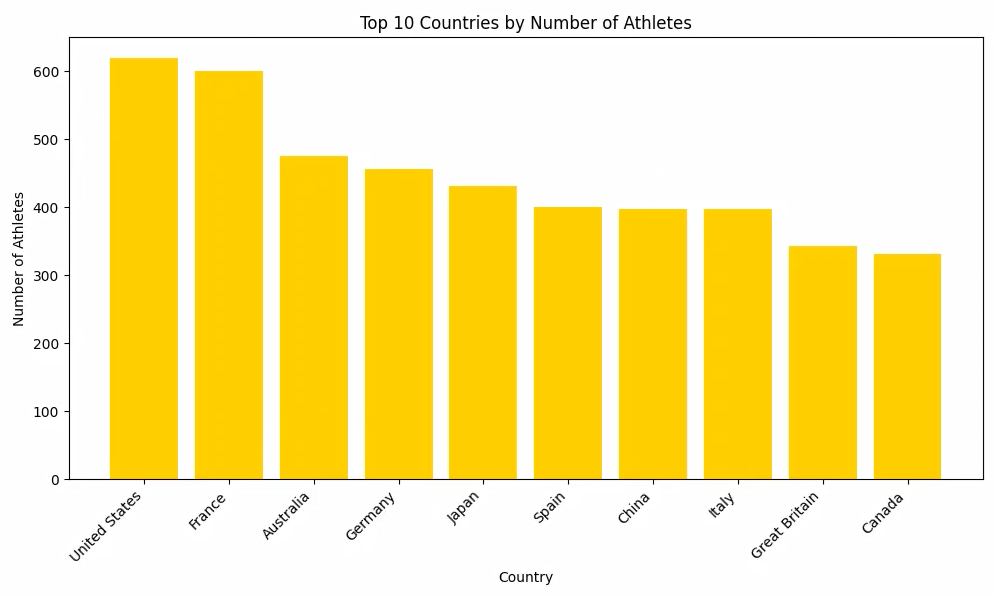
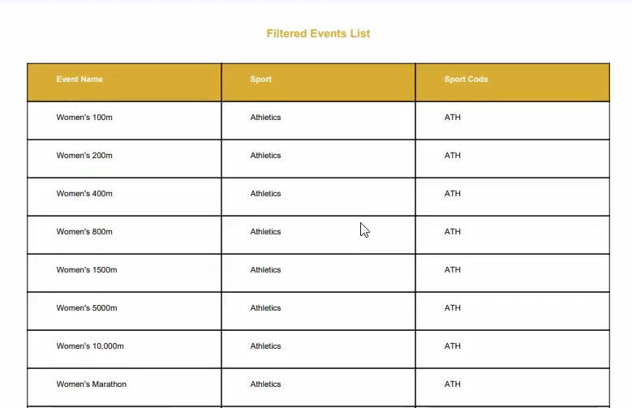

# Paris 2024 Olympics: Analytics & Visualization Engine

**A full-stack Django platform that transforms raw Olympic datasets into interactive analytics, utilizing server-side visualization and automated PDF reporting.**


-11557c?logo=python&logoColor=white)


[](docs/Project_Report.pdf)

---

## 👥 Authors

- **Ahsan Rizvi**
- **Mohammad Irtiza Hossain Mahmud**
- **Afsana Umme Kulsum Eaty**

*Department of Electrical and Computer Engineering, North South University*

---

## 🚀 Executive Summary

The **Paris 2024 Analytics Platform** addresses the challenge of making complex Olympic data accessible and actionable. Unlike static information sites, this system implements a robust **ETL (Extract, Transform, Load)** pipeline to ingest thousands of records (Athletes, Events, Medals) and serves them via a dynamic dashboard.

Key engineering highlights include **Server-Side Rendering (SSR)** for charts—generating analytics images on the backend to ensure consistency across devices—and a custom **PDF Generation Engine** for on-the-fly reporting.

---

## 📸 Application Features

### 1. The Interactive Dashboard
*A visual entry point featuring an overview of the games, dynamic counters for total medals/events, and highlighted top performers.*


### 2. Server-Side Data Analytics
*Real-time visualization of the "Top 10 Countries by Athlete Count," generated on the server using Matplotlib and streamed to the browser as binary image data.*


### 3. Automated PDF Reporting
*A production-grade PDF generation engine that allows users to download filtered event lists. The system converts HTML templates to PDF documents dynamically.*


---

## 🛠️ Technical Architecture

### 1. Custom ETL Pipeline (`olympics/import_data.py`)
We bypassed standard Django fixtures in favor of a custom Pandas-based pipeline to handle dirty data during ingestion.
```python
# Logic to handle missing birth dates and normalize country names during import
def import_athletes():
    df = pd.read_csv(file_path)
    for _, row in df.iterrows():
        Athlete.objects.create(
            name=row['name'],
            birth_date=row.get('birth_date', None), # Graceful failure handling
            sport=row['disciplines']
        )

```

### 2. Server-Side Visualization Engine

Instead of relying on heavy client-side JS libraries, charts are generated on the server for performance and reliability.

* **Backend:** Matplotlib with the `Agg` (Anti-Grain Geometry) non-GUI backend.
* **Process:** Plots are saved to an in-memory `io.BytesIO` buffer.
* **Delivery:** Django returns the buffer as an `image/png` HTTP response.

### 3. Dynamic PDF Generation

The `export_pdf` views leverage **xhtml2pdf** to render current database states into downloadable reports.

* **Context Awareness:** The PDF engine respects user-applied filters (e.g., if a user filters for "Swimming", the generated PDF only contains swimmers).

---

## ⚙️ Installation & Setup

### Prerequisites

* Python 3.8+
* Virtualenv (Recommended)

### 1. Clone the Repository

```bash
git clone [https://github.com/ahsanrizvi99/paris2024-analytics.git](https://github.com/ahsanrizvi99/paris2024-analytics.git)
cd paris2024-analytics

```

### 2. Install Dependencies

```bash
pip install -r requirements.txt

```

### 3. Initialize Database

The repository comes with a pre-populated `db.sqlite3` file. If you wish to reset it:

```bash
python manage.py makemigrations
python manage.py migrate
# Optional: Run the ETL script to re-import fresh data
python manage.py shell < scripts/run_import.py

```

### 4. Run the Development Server

```bash
python manage.py runserver

```

Visit `http://127.0.0.1:8000/` to access the dashboard.

---

## 📂 Repository Structure

```text
/Paris2024-Analytics
│
├── /paris2024                # Project Configuration (Settings, URLs)
├── /olympics                 # Main Application Logic
│   ├── import_data.py        # Custom ETL Script
│   ├── views.py              # Visualization & PDF Logic
│   ├── models.py             # Database Schema
│   └── /templates            # Frontend HTML Templates
│
├── /data                     # Raw CSV Datasets
│   ├── athletes.csv
│   └── medals.csv
│   └── events.csv
│
├── /docs                     # Documentation
│   └── Project_Report.pdf    # System Design Document
│
├── /screenshots              # Project Visuals
├── db.sqlite3                # Pre-populated Database
└── requirements.txt          # Python Dependencies

```

---

## 📜 License & Attribution

This project is released under the **Creative Commons Attribution-NonCommercial 4.0 International (CC BY-NC 4.0)** license.

**You are free to:**

* **Share** — copy and redistribute the material in any medium or format.
* **Adapt** — remix, transform, and build upon the material.

**Under the following terms:**

* **Attribution (Credit Required):** You must give appropriate credit to the original author (**Ahsan Rizvi**), provide a link to this repository, and indicate if changes were made.
* **NonCommercial:** You may not use the material for commercial purposes without explicit permission.

> *If you use this code in your own research or project, please cite:*
> **Rizvi, A. (2024). Paris 2024 Olympics: Analytics & Visualization Engine. GitHub Repository.**


